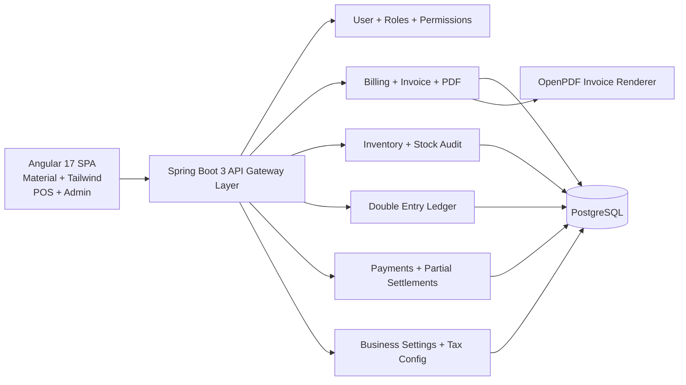

# SmartBilling — Production-Grade Billing, Inventory & Accounting Platform

## 1) Architecture Diagram



## 2) API Design (Core)

- `GET /api/customers/search?q=` searchable customer dropdown for billing.
- `POST /api/invoices` creates GST invoice, stock-out movements, debit ledger and optional payment.
- `POST /api/payments` supports cash/upi/card/credit and partial settlements.
- `GET /api/dashboard` returns revenue/outstanding/low-stock/top items snapshot.

## 3) Database Schema (Core Entities)

- `users(id, full_name, email, password_hash, role, active, created_at, updated_at)`
- `customers(id, name, phone, gst_number, address, outstanding_balance, created_at, updated_at)`
- `categories(id, name, parent_id, ...)`
- `units(id, code, label, ...)`
- `products(id, name, sku, barcode, category_id, unit_id, price, tax_rate, low_stock_threshold, ...)`
- `inventory_movements(id, product_id, quantity, movement_type, batch_no, note, ...)`
- `invoices(id, invoice_no, invoice_date, customer_id, subtotal, tax_amount, grand_total, paid_amount, ...)`
- `invoice_items(id, invoice_id, product_id, quantity, unit_price, tax_rate, line_total, ...)`
- `payments(id, invoice_id, method, amount, reference_no, ...)`
- `ledger_entries(id, customer_id, invoice_id, type, amount, narration, ...)`
- `business_settings(id, business_name, logo_url, address, gstin, signature_url, invoice_prefix, default_tax_rate, theme, ...)`

## 4) Services & Components

### Backend Services
- `BillingService` orchestrates invoice creation, payment posting, stock movement, and ledger mapping.
- `InvoicePdfService` builds branded printable invoices with table styling.
- `GlobalExceptionHandler` provides consistent validation and business error responses.

### Frontend Components
- `BillingComponent` POS flow with customer search, method selection, partial payment.
- `DashboardComponent` KPI cards (revenue, dues, low-stock, top items).
- `ProductsComponent` product/category UX blueprint.
- `CartState` centralized signal-based cart state.
- `errorInterceptor` for centralized API error handling.

## 5) Monorepo File Structure

```text
backend/
  src/main/java/com/smartbilling/
    config/ common/ domain/ repository/ dto/ service/ web/ pdf/
frontend/
  src/app/
    core/{interceptors,layout,services,state}
    features/{billing,dashboard,products,...}
deploy/
  Dockerfile.backend
  Dockerfile.frontend
  nginx.conf
.github/workflows/
  ci.yml
```

## 6) UI Mock-ups

### POS Billing (Desktop)
```text
+--------------------+---------------------------------------+
| Customer Search    | Cart                                  |
| [search input]     | Item1 x2  ₹200                        |
| [dropdown results] | Item2 x1  ₹150                        |
| [quick add button] | Total      ₹350                       |
|                    | Payment Method [CASH v]               |
| Products grid/list | Paid Amount [___]                     |
| add to cart        | [Generate Invoice]                    |
+--------------------+---------------------------------------+
```

### Mobile POS
```text
[Customer]
[Products]
[Cart Summary]
[Pay + Print]
```

## 7) Enterprise Enhancements Roadmap

- Add JWT auth + refresh tokens and RBAC matrix table (`role_permissions`).
- Add audit log middleware for all write APIs.
- Migrate schema management to Flyway.
- Add Redis caching for dashboard queries.
- Add async queue (Kafka/RabbitMQ) for invoice events and notifications.
- Introduce stock snapshot table for accurate low-stock analytics.
- Add barcode/QR print labels and scanner integration.

## 8) Deployment Plan

1. Build backend JAR and frontend static bundle.
2. Run PostgreSQL with persistent volume.
3. Deploy backend + frontend containers behind Nginx reverse proxy.
4. Enable HTTPS via certbot/managed certs.
5. Configure observability (Prometheus + Grafana + centralized logs).

### Quick Shared Server Setup (Docker Compose)

1. Provision one Linux server (Ubuntu 22.04+), install Docker + Docker Compose.
2. Clone this repo on server.
3. Start full stack:

```bash
cd deploy
docker compose up -d --build
```

4. App will be available on `http://<server-ip>/`.
5. All developers use the same deployed app URL and same PostgreSQL data volume (`pg_data`).

Notes:
- Backend DB/server settings are environment-driven (`SPRING_DATASOURCE_*`, `SERVER_PORT`).
- CORS origins are configurable with `APP_CORS_ORIGINS` (comma-separated).

### Hosted Setup (Supabase + Render + Vercel)

- Supabase project URL: `https://ldedhxcilbgfgmpnocht.supabase.co`
- Backend (Render): `https://business-management-hyoh.onrender.com`
- Frontend (Vercel): `https://business-management-alpha.vercel.app/`

Render environment variables:
- `SPRING_DATASOURCE_URL=jdbc:postgresql://db.<project-ref>.supabase.co:5432/postgres?sslmode=require`
- `SPRING_DATASOURCE_USERNAME=<supabase_db_user>`
- `SPRING_DATASOURCE_PASSWORD=<supabase_db_password>`
- `APP_CORS_ORIGINS=https://business-management-alpha.vercel.app,http://localhost:4200`
- `SERVER_PORT=10000`

Vercel:
- `frontend/vercel.json` rewrites `/api/*` to Render backend, so frontend can keep using relative `/api`.

## 9) CI/CD Plan

- On PR: run backend unit tests + lint + frontend build checks.
- On main merge: build Docker images, push to registry, trigger deployment.
- Add blue/green deployment with health checks (`/actuator/health`).

